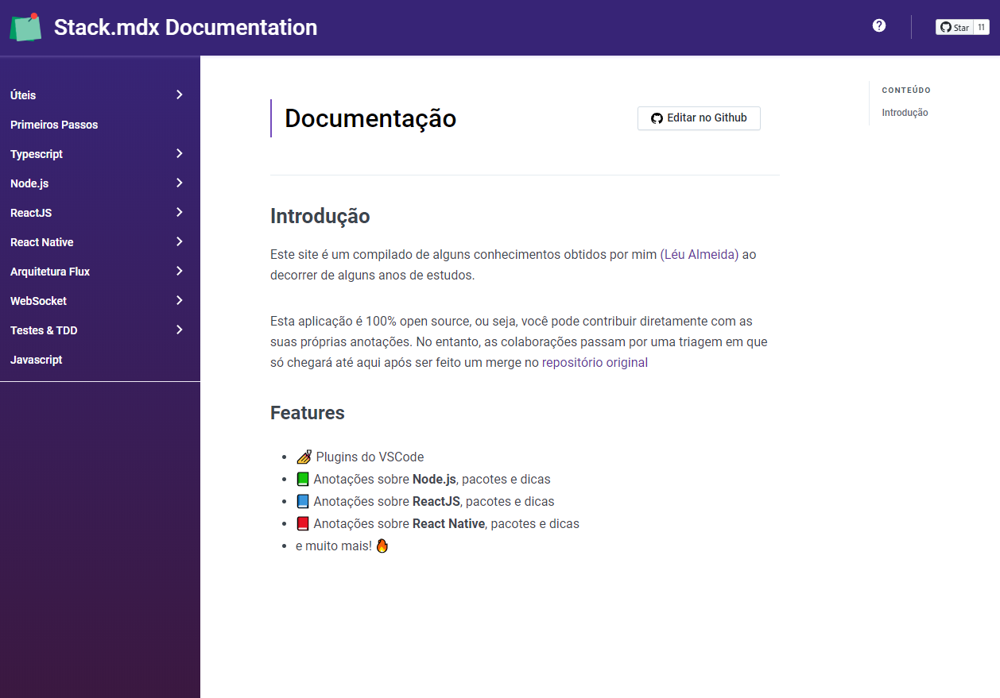

  

<h2 align="center">
  Leunardo.dev Documentation
</h2>

  A compilation of some knowledge obtained by me over the course of some years of studies.

  

  

  

<h4>
ToDo:

- [ ] English translation
- [ ] JavaScript documentation

<h3 align="center">Contributors</h3>

