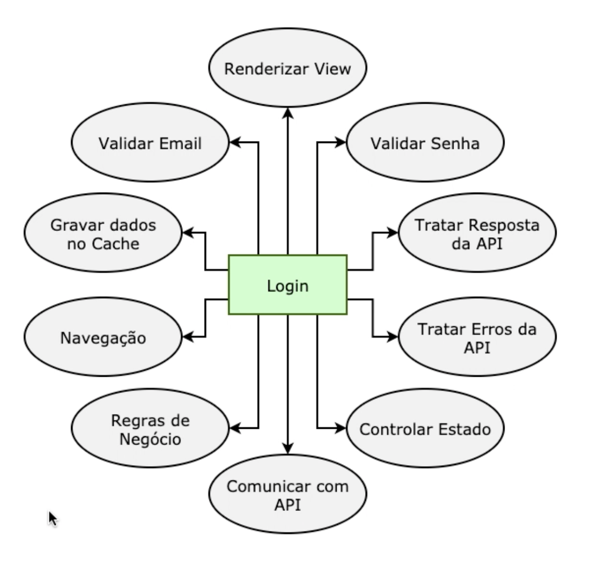
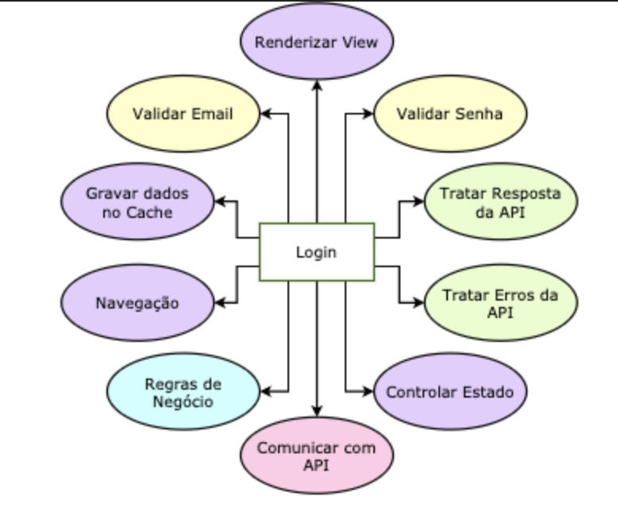
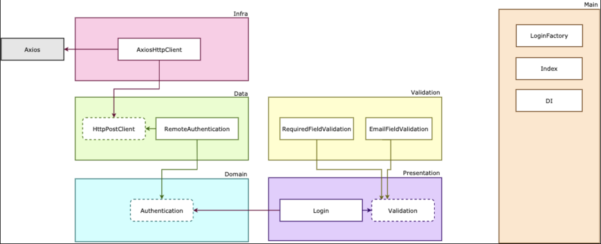

## Modelo Padrão (sem Clean Architecture)

## Modelo Correto (com Clean Architecture)

### Camada de Domain
Criação das regras de negócio com interfaces.

### Camada de Data
Implementações dos casos de uso utilizando algum tipo de implementação, sendo esta uma implementação concreta da interface existente no domain. <mark>Ele não faz a requisição em si, mas lida com as respostas e erros</mark>.

### Camada de Infra
A camada que realiza as requisições, utilizando as interfaces e implementações existentes no Data Layer.

### Camada de Presentation
É a camada de apresentação, conversão e tratamento de dados e controle de User Interface (UI).

### Camada de Validation
Camada responsável pela validação de campos (como alternativa para o React Hooks Forms ou Formik)

### Camada de Main
É a camada que dependerá de todas as camadas. Seu objetivo é implementar as layers anteriores
