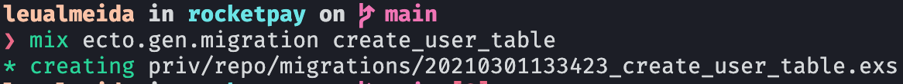
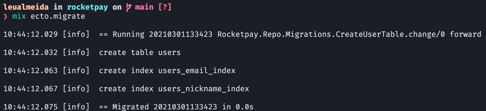
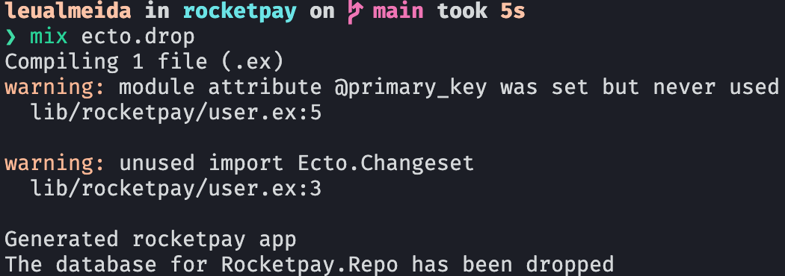

# O que é

Ecto é um projeto oficial do Elixir que fornece uma camada de banco de dados e linguagem integrada para consultas. Com Ecto podemos criar migrações, definir esquemas, inserir e atualizar registros, e fazer consultas.

# Configurando o banco de dados

Com as variáveis do banco definidas nos arquivos dentro de `/config/*.exs`, roda-se o comando abaixo para configurar o banco de dados

```bash
mix ecto.crete
```

Caso haja algum erro, certifique-se que o banco de dados está configurado corretamente e rodando.

# Migrations

### Criando uma migration

Para criar uma migration, basta rodar o comando abaixo.
<mark>No Elixir não é necessário criar um método up e um método down, embora isso seja possível.</mark>

```bash
mix ecto.gen.migration NOME_DA_MIGRATION
```

Output:


Exemplo de migration:

```elixir
defmodule Rocketpay.Repo.Migrations.CreateUserTable do
  use Ecto.Migration

  def change do
    # Criação da tabela e colunas
    create table :users do
      add :name, :string
      add :age, :integer
      add :email, :string
      add :password_hash, :string
      add :nickname, :string

      timestamps() # Cria as colunas created_at e updated_at
    end

    # Criação de índices pertinentes a determinadas colunas
    create unique_index(:users, [:email])
    create unique_index(:users, [:nickname])
  end
end
```

Para rodar a migration, basta rodar o comando:

```bash
mix ecto.migrate
```

Output:


Para dar rollback no banco (drop), basta rodar o comando:

```bash
mix ecto.drop
```

Output:


### Configuração de FK e ID

Para configurar a foreign key e ID único como UUID, deve-se incluir as seguintes linhas no arquivo `config.exs`:

```elixir
# config/config.exs

config :rocketpay, Rocketpay.Repo,
  migration_primary_key: [type: :binary_id],
  migration_foreign_key: [type: :binary_id]
```
