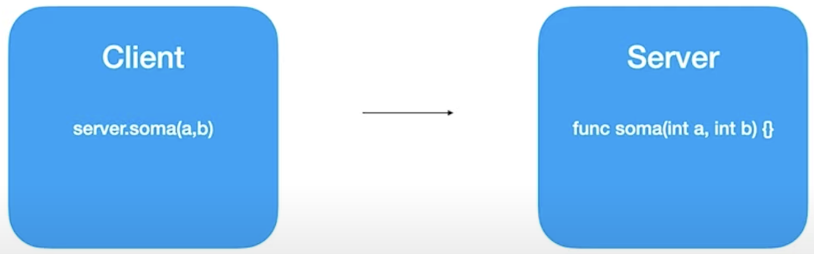
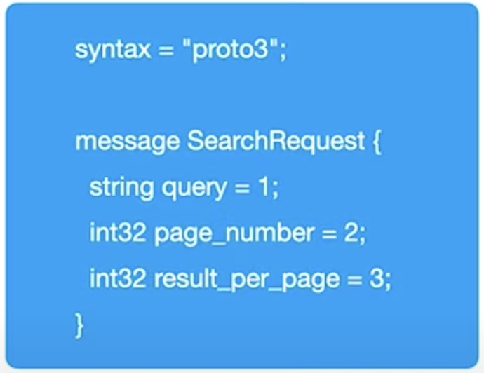
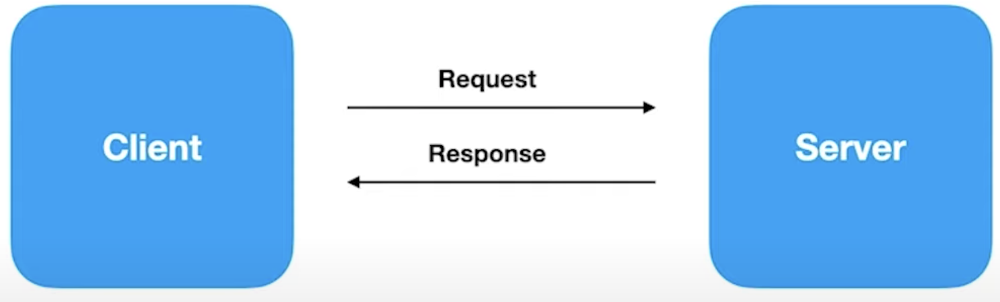
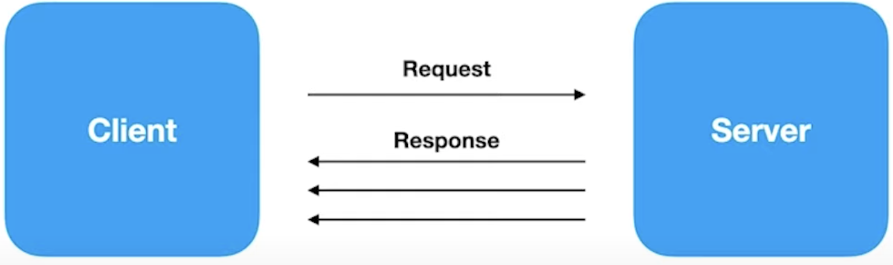
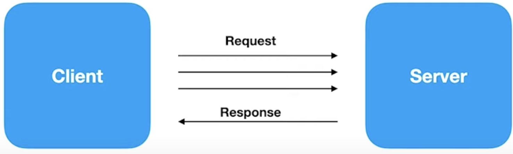
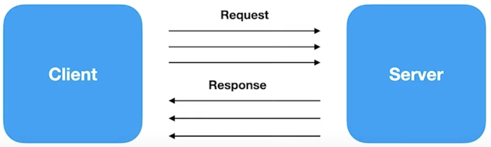

# O que é
gRPC é um framework desenvolvido pela Google que tem o objetivo de facilitar o processo de comunicação entre os sistemas de uma forma extremamente rápida, leve e independente de linguagem

# Em quais casos utilizar

- Ideal para microsserviços
- Mobile, Browsers, Backend
- Geração de bibliotecas de forma automática
- Streaming bidirecional utilizando HTTP/2

# Linguagens que Aceitam o gRPC

- gRPC-GO
- gRPC-JAVA
- gRPC-C
  - C++
  - Python
  - Ruby
  - Objective C
  - PHP
  - C#
  - Node.js
  - Dart
  - Kotlin / JVM

# RPC - Remote Procedure Call

# Protocol Buffers
_"Protocol Buffers are Google's language-neutral, platform-neutral, extensible mechanism for serializing structured data - think XML, but smaller, faster and simpler."_

Arquivo **.proto**

<!--  -->

# Protocol Buffers vs JSON
- Arquivos binários > JSON
- Processo de serialização é mais leve (CPU) do que JSON
- Gasta menos recursos de rede
- Processo é mais veloz

# HTTP 2

- Nome original criado pela Google era SPDY
- Lançado em 2015
- Dados trafegados são binários e não texto como no HTTP 1.1
- Utiliza a mesma conexão TCP para enviar e recebr dados do cliente e do servidor (Multiplex)
- Server Push
- Headers são comprimidos
- Gasta menos recursos de rede
- Processo é mais veloz

# gRPC - API Unary

# gRPC - API Server Streaming

# gRPC - API Client Streaming

# gRPC - API Bi-Directional Streaming

# Rest vs gRPC

### Rest

- Texto / JSON
- Unidirecional
- Alta latência
- Sem contrato (maior change de erros)
- Sem suporte a streaming (Request / Response)
- Design pré-definido
- Bibliotecas de terceiro

### gRPC
- Protocol Buffers
- Bidirecional e Assíncrono
- Baixa latência
- Contrato definido (.proto)
- Suporte e streaming
- Design é livre
- Geração de código
